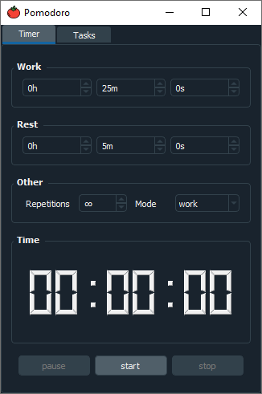
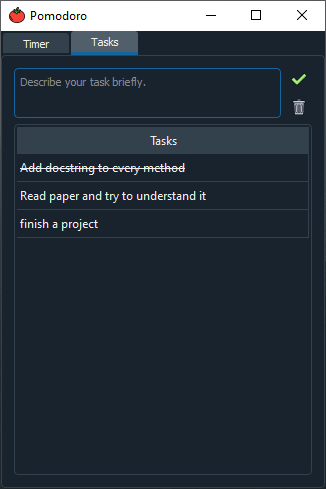

# Pomodoro
A small pomodoro GUI for Windows/Linux created with PyQt5.

## Features

The "Timer" tab allows you to set your desired work and rest times aswell as other settings. Starting, pausing and reseting the timer can also be done in this tab. Settings made in this tab, except repetitions and mode, are saved across multiple instances.

  
 

 
The "Tasks" tab allows you to write down your tasks that you want to accomplish in that pomodoro session. Its a good practice to break down big tasks into smaller tasks. Don't worry if you can't finish all your tasks in a session, since the tasks are also saved across multiple instances. You can mark a task as "finished" by double clicking it. Finished tasks are not saved.

  

The "Statistics" tab helps you keep track of how much you have worked, rested and the total amount (rest time + work time) you have spend.

  

The application currently uses your systems own notification system. Make sure to turn on notifications in your system settings while using this application.

  

The program lives inside your systems traysystem, so "X"-ing out of the GUI will not quit the programm, it will rather hide itself so that it doesnt occupy any space in your taskbar.
To quit it, right click the tomato icon in your traysystem and press the quit button.

  

## Install/Usage
This section gives an overview on how to use the program.

### General
1. Install dependencies

    pip3 install -r requirements.txt

2. Run

    python3 pomodoro.py

### Executable (Windows only)
1. Install pyinstaller

    pip3 install pyinstaller

2. Create executable file

    pyinstaller pomodoro.spec

This will create a "build" and a "dist" folder. The "dist" folder will contain a pomodoro folder where the executable is located. Now you're
able to run the application by executing "pomodoro.exe"
Alternatively install the application from the <a href=https://github.com/burakmartin/pomodoro/releases>releases</a> tab. The installer is created with InstallForge which just bundles up
the folder created with pyinstaller and lets you choose an installation path. It also comes with an uninstaller.